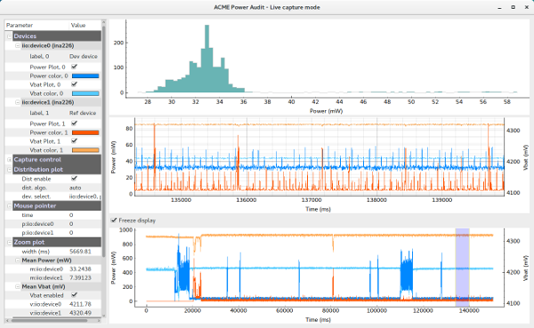

# pyacmegraph
[ACME](http://baylibre.com/acme) power probe capture and analysis tool



**Major features:**
 - auto-detects connected probes and Rshunt, captures data
 - computes and displays Power consumption and Vbat with multiple zoom capabilities
 - basic stats (mean on Power, Vbat, distribution graph)
 - save captured data for later visualization (view mode), save as text and image
 - control ACME power switch

**Please submit bugs or feature requests using this project [Issues](https://github.com/baylibre-acme/pyacmegraph/issues) tracking.**

# Usage
## Examples
```
pyacmegraph.py --ip <ip address or network name of the ACME board>

pyacmegraph.py --ip myacme.local --load capture.acme
   => starts in display mode (no capture), loads and displays data from capture.acme file

pyacmegraph.py --ip myacme.local --load capture.acme
   => Captures data, but initializes parameters from capture.acme file
```

## Options
```
usage: pyacmegraph.py [-h] [--load file] [--template file] [--inttime [value]]
                      [--oversmplrt value] [--norelatime] [--ip IP]
                      [--shunts SHUNTS] [--vbat VBAT] [--ishunt]
                      [--forcevshuntscale [scale]] [--timeoffset time]
                      [--verbose]

ACME measurements capture and display tool.

optional arguments:
  -h, --help          show this help message and exit
  --load file         load .acme file containing data to display (switches to
                      display-only mode)
  --template file     load .acme file settings section only (colors, plot
                      names, shunts ...). Useful for starting a fresh capture
                      session re-using a previous saved setup
  --inttime [value]   integration time to use instead of default value
                      (0.000588s). Use without value to get the list of
                      accepted values
  --oversmplrt value  oversampling ratio to use instead of default value (1)
  --norelatime        display absolute time from device
  --ip IP             IP address of ACME
  --shunts SHUNTS     list of shunts to use in mOhms (comma separated list,
                      one shunt value per channel, starting at channel 0) Ex:
                      100,50,250
  --vbat VBAT         Force a constant Vbat value (in Volts) to be used for
                      computing power, in place of ACME measured vbat
  --ishunt            Display Ishunt instead of Power (do not capture Vbat and
                      do not compute Power
  --forcevshuntscale [scale]
                      Override Vshunt scale value, and force application
                      start even if identifying a Vshunt scaling problem
  --timeoffset time   Add an offset to displayed time (can be negative) in
                      offline mode
  --verbose, -v       print debug traces (various levels v, vv, vvv)

This tools captures exclusively Vbat and Vshunt values from ACME probes. Using Rshunt
(auto-detected or forced), it computes and displays the resulting power (Vbat*Vshunt/Rshunt).
Capture settings are automatically setup to optimize sampling resolution, but can be overriden.
Example usage:
./pyacmegraph.py --ip baylibre-acme.local --shunts=100,50,250 -v
./pyacmegraph.py --load capture.acme --timeoffset -10253
```

## Getting Started

### Prerequisites
 - Python 2.7
 - ACME board running a recent distro with iio
 See here for latest IIO capable SW release:
 - [pre-built image with IIO](https://github.com/baylibre-acme/ACME/releases)
or
 - [building the SW with IIO](https://github.com/baylibre-acme/ACME)

### Installing on Linux

Install Python 2.7 and following python extensions: numpy, pyqt4, pyqtgraph. Ex.:
```
sudo apt-get install python-numpy python-qt4 python-pyqtgraph
```
(for pyqtgraph debian package, you may need to install the related .deb from [pyqtgraph](http://www.pyqtgraph.org) website, or add the project-specific Debian repository)

Get a recent version of [libiio](https://wiki.analog.com/resources/eval/user-guides/ad-fmcdaq2-ebz/software/linux/applications/libiio), build and install it on your host.

Example (see libiio guidelines for more details):
```
sudo apt-get install libxml2 libxml2-dev bison flex libcdk5-dev libavahi-client-dev cmake git
git clone https://github.com/analogdevicesinc/libiio.git
cd libiio
cmake ./
make all
sudo make install
```
(Do not install the libiio package from your distribution, like python-libiio. It is outdated and misses features and bug-fixes for python bindings [Nov. 2016].)

Build and install libiio python bindings.
Example how to do it from source:
```
cd bindings
cmake ./
make
sudo make install
```


### Installing on Windows
2 options: pre-bundled python app for Win64 platforms, or full python install (32/64 bits).

#### Option 1: python bundle
We pre-bundle some versions of pyacmegraph with its python dependencies into a single .exe (64bits) to ease installation on windows platforms (tested on Win7 64bits). You do not need to install python. Install instructions:
 - install libiio library (get latest development version - libiio-setup.exe):  https://ci.appveyor.com/project/analogdevicesinc/libiio/build/artifacts?branch=master
 - install VC++ runtime libraries (vcredist_x64.exe): https://www.microsoft.com/en-us/download/details.aspx?id=40784
 - get pyacmegraph.exe bundle for Windows 64: https://drive.google.com/open?id=0B5g5aMFBS6lMa01yUW9BLUVmZDQ
 - run pyacmegraph.exe

#### option 2: install python and its extensions
Here are detailed instructions to get the latest pyacmegraph.py script to run on Windows:
 - install python 2.7:  https://www.python.org/downloads/release/python-2712/
 - add python to the PATH (if not done at install-time): control panel > system > advanced > |Environmental Variables| > system variables -> Path
 - install missing packages using pip:
```python.exe -m pip install numpy pyqtgraph```
 - install PyQt4:
   - download .whl file for pyqt4 - be carefull to choose the proper 32/64bits version: http://www.lfd.uci.edu/~gohlke/pythonlibs/#pyqt4 (get something like (python 2.7): PyQt4-4.11.4-cp27-none-win_amd64.whl)
   - install it:
```python.exe -m pip install <path to .whl file>```
 - install libiio library (get latest development version - libiio-setup.exe):  https://ci.appveyor.com/project/analogdevicesinc/libiio/build/artifacts?branch=master
 - install VC++ runtime libraries (vcredist_x86.exe or vcredist_x64.exe): https://www.microsoft.com/en-us/download/details.aspx?id=40784


## License

This project is licensed under the MIT License - see the [LICENSE](LICENSE) file for details
